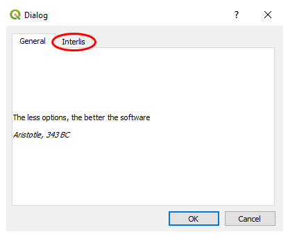
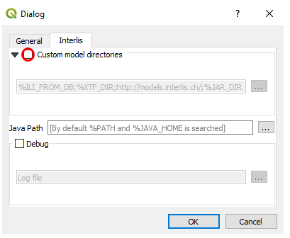
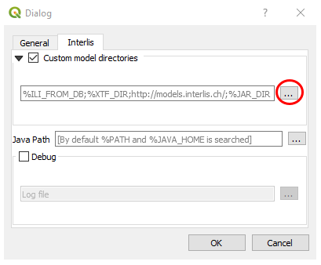
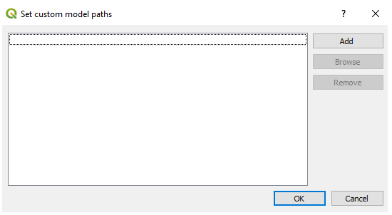
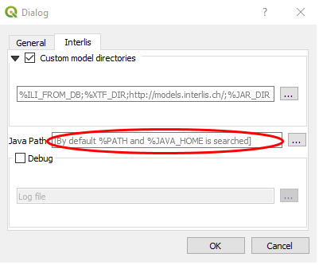
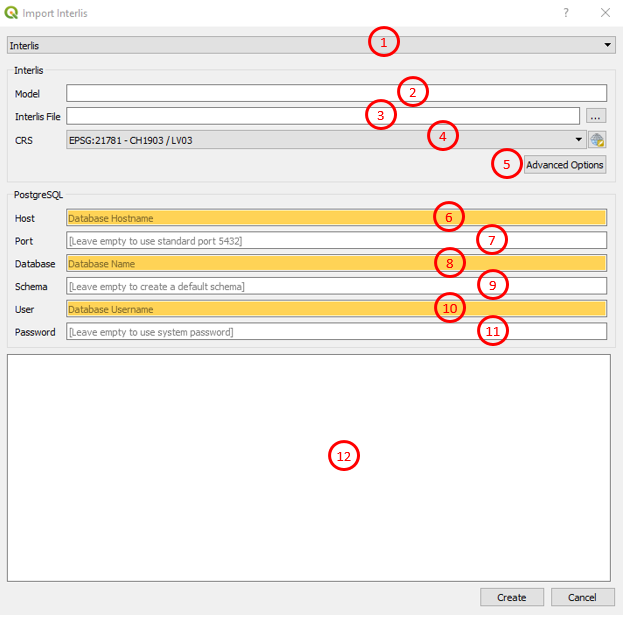
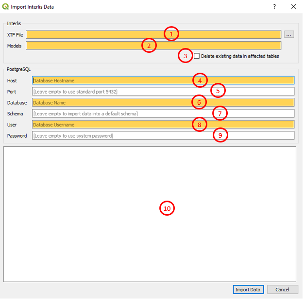
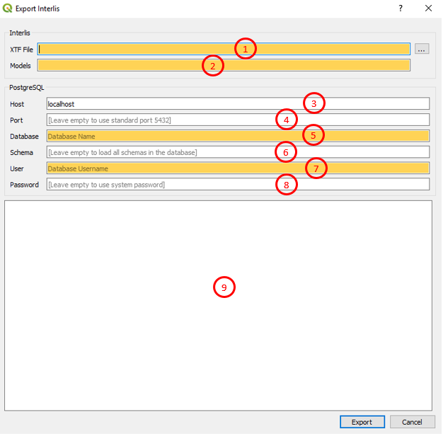

=========================================
User guide for the QGIS Project Generator
=========================================

.. contents::

Introduction
============

This document contains information about Project Generator usage for QGIS 3.

This is a QGIS plugin to quickly generate QGIS projects from an existing model with a few mouseclicks.

Configuring QGIS layers and forms manually is a tedious and error prone process. This plugin loads database schemas with various meta information to preconfigure the layer tree, widget configuration, relations and more.

Interlis models contain more information than a plain database schema. This plugin uses ili2pg to import an Interlis model into a PostgreSQL/PostGIS database and uses the additional meta information to configure the user interface even better.

Generate Project
================

To generate configured QGIS projects from Interlis models or PostgreSQL/PostGIS schemas, go to menu Database -> Project Generator -> Generate. The result QGIS project is ready to capture and edit data according to the rules defined in source Interlis models. This includes a custom layer tree order, layer edit forms with appropriate widgets per attribute type, constraints, domains (lists of values allowed for certain attributes), relations among layers and more. 

Dialog options are described in the following lines (use numbers to locate specific options in the picture). 

|generate|

**1.	Generation Mode**
Project Generator is able to generate QGIS projects from both Interlis models or PostgreSQL/PostGIS existing schemas. You should start using this list to choose what mode you want the plugin to work on.

If you choose `Interlis` Project Generator employs ili2pg under the hood to convert your (conceptual) Interlis models into phisical ones stored in PostgreSQL/PostGIS. As long as you have Internet access when you first run the plugin, you shouldn't care about installing ili2pg, since Project Generator will download it and place it in a plugin's subfolder.

If, on the contrary, you choose `PostGIS`, Project Generator uses a PostgreSQL/PostGIS schema to generate your QGIS project. This option allows you to reconstruct a QGIS project from Interlis models, even if they were already converted into phisical models. Note that you could eventually use the plugin for generating QGIS projects from your PostgreSQL/PostGIS schemas, even if they are not related to Interlis in any way, however, Project Generator exploits Interlis expressiveness and we suggest you to use it with Interlis-based models.

**2.	Interlis Model (only for Interlis mode)**
Based on the Custom Model Directories you set in Plugin Configuration (link), you can choose what models you want to convert into a PostgreSQL/PostGIS schema. Model names are specified in interlis model (ili) files. An ili file can contain a number of models. Since model names should be given strictly as they were spelled in Interlis files, once you start typing, autocompletion will help you discover available models with their correct spelling.

**3.	Interlis File (only for Interlis mode)**
You could get rid of Custom Model Directories and model names and use Interlis model (ili) files directly. The Interlis file you choose will be used to convert your models into a PostgreSQL/PostGIS schema.

**4.	Coordinate Reference System - CRS (only for Interlis mode)**
You can set the CRS you want to use for geometry tables defined in your Interlis models. CRS information will be stored into PostgreSQL/PostGIS.

**5.	Advanced options (only for Interlis mode)**
Since Project Generator uses ili2db when in Interlis mode, you can set advanced options that determine how your conceptual object-oriented model is mapped into a PostgreSQL/PostGIS  relational model.

***Inheritance***

ili2db allows you to use three types of inheritance mapping: "noSmartMapping", "smart1inheritance" and "smart2inheritance":

 + **noSmartMapping** This kind of inheritance maps all classes from the source Interlis model into the target database schema. Each class mantains all its attributes.

 + **smart1inheritance** This kind of inheritance prefers to create parent classes into the database, as long as they fulfill some specific requirements. Attributes from children classes will not be lost, since they are transferred into parent ones.

 + **smart2inheritance** This kind of inheritance prefers to create children classes into the database. Attribute from parent classes will not be lost, since they are transferred into children ones.
 
***Extra Model Information File***
 
A \*.toml file containing values for meta attributes (like dispExpression) instead of having them directly in the Interlis file. The file can be selected per model configuration.

**6.	Database Host**
Set the host of the database server. By default is localhost.

**7.	Database Port**
Set the port of the database server. By default is 5432.

**8.	Database Name**
Set the database name. The database should exist already.

**9.	Database Schema**
Set the database schema where you want to create the phisical model. The schema acts like a folder, it helps you to organize database objects like tables and relations and isolate them from other schemas. If you don't specify a database schema, Project Generator will create a schema for you, whose name will correspond to the database name. You can even choose an existing schema, but you'd better know what you're doing, because it will overwrite previous ili2db configurations.

**10.	Database User**
Set the user to access the database.

**11.	User Password**
Set the password for the database user.

**12.	Log Panel**
This panel shows log messages of the whole process once Create button is clicked. If in Interlis mode, the Log Panel will show you what ili2pg command was executed (including parameters), as well as the ili2pg output. If in PostGIS mode, the Log Panel shows you what layers are being loaded into QGIS Project.

Import an Interlis Transfer File (.xtf)
=======================================

To import data from Interlis Transfer Files (XTF) into PostgreSQL/PostGIS schemas, go to menu Database -> Project Generator -> Import Interlis Transfer File (.xtf). 

Dialog options are described in the following lines (use numbers to locate specific options in the picture). 

|import|

**1.	XTF File**
Set source XTF file location. The XTF is an Interlis Transfer File, containing spatial and/or alphanumeric data. Usually, you generate XTF files running Export data to Interlis Transfer File (.xtf).

**2.	Models**
Based on the Custom Model Directories you set in Plugin Configuration (link), you can choose what models you want to use to import data from the source XTF file.

**3.	Delete existing data in affected tables**
Enabling this option deletes all existing data in tables where the import will insert data from the XTF file.

**4.	Database Host**
Set the host of the database server. By default is localhost.

**5.	Database Port**
Set the port of the database server. By default is 5432.

**6.	Database Name**
Set the database name. The database should exist already.

**7.	Database Schema**
Set the database schema where you want to import data from the XTF file. Normally, you would import data into existing schemas, but you could also import your data into new schemas. In the former case, your data are expected to follow the model with which the existing schema was generated, otherwise errors may occur. In the latter case, a new schema will be generated with default parameters given by Project Generator and from previous sessions (if you have run Generate before).

**8.	Database User**
Set the user to access the database.

**9.	User Password**
Set the password for the database user.

**10.	Log Panel**
This panel shows log messages of the whole process once Import button is clicked. It will show you what ili2pg command was executed (including parameters), as well as the ili2pg output.

Export an Interlis Transfer File (.xtf)
=======================================

To export data from PostgreSQL/PostGIS schemas into Interlis Transfer Files (XTF), go to menu Database -> Project Generator -> Export Interlis Transfer File (.xtf).

Dialog options are described in the following lines (use numbers to locate specific options in the picture).  

|export|

**1.	XTF File**
Set the XTF file where you want to export your data to.

**2.	Models**
Set models you want to use to filter the data that will be exported.

**3.	Database Host**
Set the host of the database server. By default is localhost.

**4.	Database Port**
Set the port of the database server. By default is 5432.

**5.	Database Name**
Set the database name. The database should exist already.

**6.	Database Schema**
Set the database schema where data is located before exporting them to XTF.

**7.	Database User**
Set the user to access the database.

**8.	User Password**
Set the password for the database user.

**9.	Log Panel**
This panel shows log messages of the whole process once Export button is clicked. It will show you what ili2pg command was executed (including parameters), as well as the ili2pg output.

Plugin Configuration
====================

To start using the plugin, go to menu Database -> Project Generator -> Settings, where you can set:

 + **Custom Model Directories**:

   In this window you can set one or several paths to let ili2db where to find your Interlis models (ili files). Paths can be both local directories or URLs to remote model repositories. Several paths should be separated by semicolons.

   By default, ili2db uses `%ILI_FROM_DB;%XTF_DIR;http://models.interlis.ch/;%JAR_DIR`, where:

    -  `%ILI_FROM_DB` is a placeholder for the models in the database (in table t_ili2db_model),
    -  `%XTF_DIR` is a placeholder for the directory with the transfer file,
    -  `%JAR_DIR` is a placeholder for the ili2db program (ili2pg.jar or ili2gpkg.jar file).

 + **Java Path**:

   By default, Project Generator searches for Java executable in `%JAVA_HOME` environment variable. However, you can overwrite such behavior by setting a custom path to Java executable file in this window. This is useful, for instance, when environment variables are not well set and you have no rights to set them in your machine's operating system.

|settings_1|

|settings_2|

|settings_3|

|settings_4|

|settings_5|

:Author: Sergio Ramírez, Germán Carrillo
:Date: Aug 24, 2017
